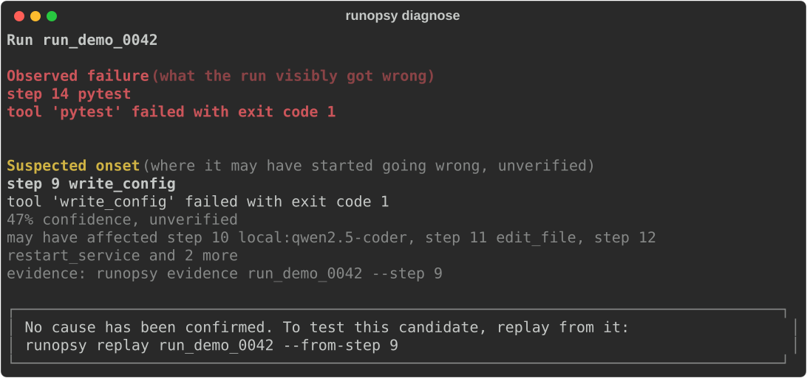
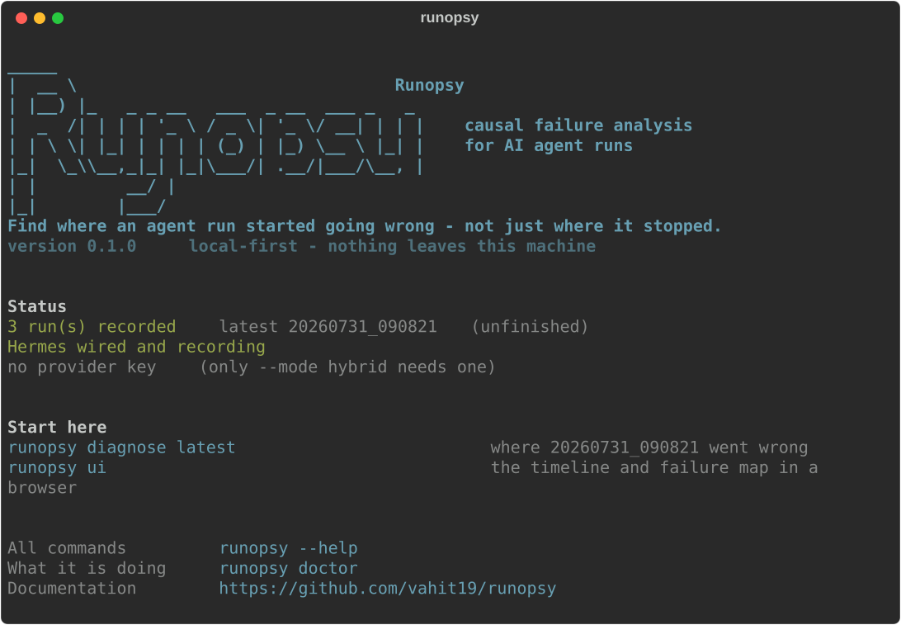
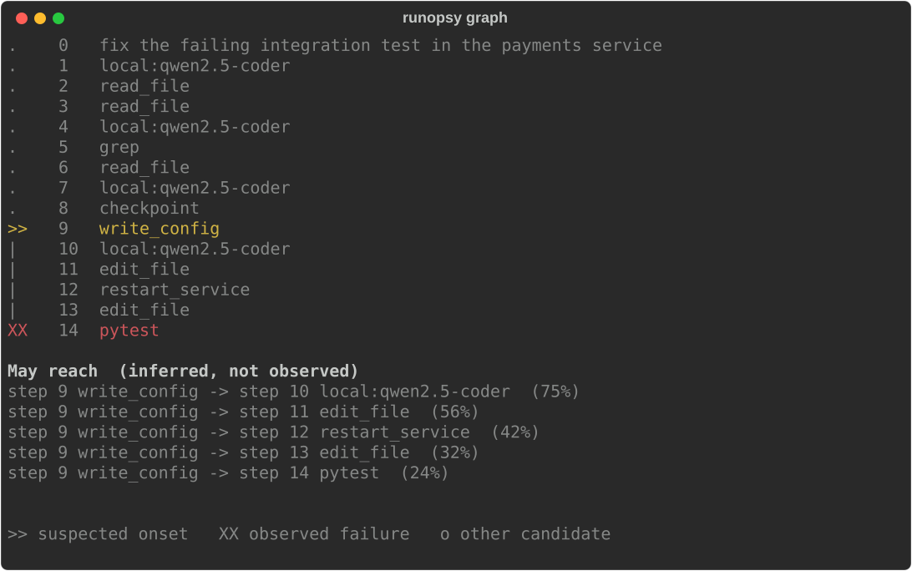
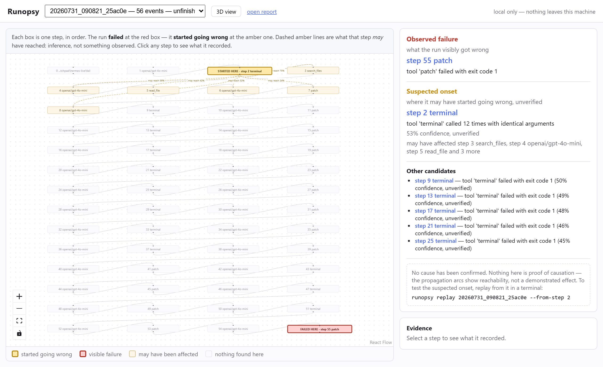
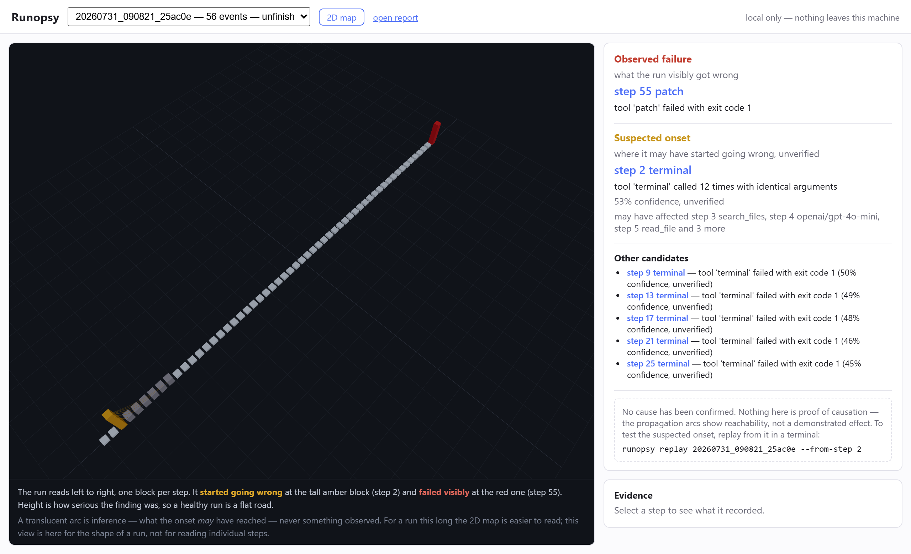

# Runopsy

**Find where an AI agent run started going wrong — not just where it stopped.**

[](https://github.com/vahit19/runopsy/actions/workflows/ci.yml)
[](https://github.com/vahit19/runopsy/actions/workflows/security.yml)
[](https://pypi.org/project/runopsy/)
[](https://pypi.org/project/runopsy/)
[](LICENSE)

```bash
uv tool install runopsy && runopsy demo
```

That installs everything and runs a worked example: no agent, no API key, no
configuration. If you would rather not install a tool globally, `pip install runopsy`
into a virtualenv does the same.

When an agent fails, the last error is rarely the problem. A config written wrongly at
step 9 surfaces as a failing test at step 14, and reading the log bottom-up sends you to
fix the test. Runopsy records agent runs, localizes the step where things actually broke,
shows the evidence behind that claim, and plans a controlled replay to test it.

It runs locally, spends no tokens for its core analysis, and never claims a cause it has
not validated.

<p align="center">
  
</p>

The run above failed at step 14. It broke at step 9. Every image in this README is
rendered from real command output by [`scripts/render_demo.py`](scripts/render_demo.py)
— none of them is a mock, in a project whose argument is that a confident statement can
be checked.

## What Runopsy is, and is not

**It is not a coding assistant, and it does not replace the one you use.** Runopsy has
no chat, writes no code and makes no suggestions. It attaches to whatever already runs
your work — an agent, a CI pipeline, a Makefile — records what happened, and tells you
where it started going wrong.

| you already have | Runopsy adds |
| --- | --- |
| an agent (Hermes today) | `runopsy run "task"` drives it and diagnoses the session |
| a pipeline or test suite | `runopsy record -s "make" -s "pytest"` wraps it |
| Inspect AI eval logs | `runopsy-inspect import` reads them |
| nothing yet | the worked example, in one command |

So there is no model to pick and no key to enter for the core product: deterministic
diagnosis spends zero tokens and makes zero network calls. A provider key buys exactly
one optional thing — `--mode hybrid`, which asks a model about the few steps already
found suspicious — and `runopsy setup` stores it in your OS keyring when you want it.

**What makes it different** is not the visualisation, which anyone could rebuild. It is
that Runopsy will *test* its own claim: `runopsy replay --execute` re-runs the trace in a
disposable sandbox with one thing changed, and only upgrades a suspicion to a cause when
the downstream failures actually disappear. Every other tracing tool shows you what
happened. This one says where it broke and then tries to prove itself wrong.

## Does it actually work?

Measured on 20 labelled traces with declared ground truth, reproducible offline with
`runopsy bench --compare`:

| strategy | top-1 | top-3 | mean step distance |
| --- | ---: | ---: | ---: |
| no diagnosis | 0.0% | 0.0% | — |
| blame the last failing step *(what reading a log achieves)* | 22.2% | 44.4% | 3.50 |
| blame the earliest failing step | 50.0% | 50.0% | 1.31 |
| **Runopsy deterministic engine** | **94.4%** | **100.0%** | **0.11** |

Zero false positives on healthy runs — a spurious finding is what gets a diagnosis tool
switched off, so that threshold is exact rather than approximate.

**What this does not show.** These are synthetic single-fault traces. They establish that
the ranking behaves as designed; they do not establish that it saves anyone time on real
work. That needs fault injection on real workloads and a measured reduction in
time-to-diagnosis. The full report, including the cases the engine still misses and the
failures it cannot see at all, is in [`benchmarks/baseline-report.md`](benchmarks/baseline-report.md).

How much that gap matters is not a guess. The first real agent session recorded — a live
Hermes run fixing an ordinary bug — broke the engine in a way none of the twenty cases
had: the agent re-ran its verification command after every edit, and the loop detector
read seven identical calls as being stuck, outranking the steps that had actually failed.
Synthetic traces only ever repeat a call when something *is* stuck, so "same arguments"
and "making no progress" were never distinguishable in them. The obvious fix — demand
identical outputs — then went silent on a run that spent twenty-five steps cycling
between two answers, so the rule became whether calls keep turning up results that are
*new*. Both corrections, and the regressions that pin them, are in
`tests/test_real_run.py`.

Across the real runs recorded so far the engine behaves: clean successes produce no
findings at all, the stuck run names its loop, and the run that failed and recovered says
so in those words. None of the corrections moved the table above by a tenth of a point,
which is the honest summary of what that table measures — the ranking, not the product.

Seven of the fifteen detectors have now produced a finding on a real recorded run, up
from three. Two of the new ones only became reachable when the trace started carrying the
working tree: an agent that commits and undoes its own work is invisible in a log of
commands, and shows up immediately as a repository state returning to somewhere it had
already been. Three detectors, though, cannot fire on a recorded run at all —
`retry_storm` keys on a field no adapter sets while recording, and two others need event
kinds this runtime never emits — so they are exercised solely by traces we wrote
ourselves. That is stated here rather than left to be discovered.

## What you get

<p align="center">
  
</p>

Typing `runopsy` with no arguments tells you where this machine stands — what has been
recorded, whether a runtime is connected, whether a key is set — and suggests the one or
two commands that make sense from there. The suggestions change with the state, because
telling somebody to diagnose a run when they have recorded none is how a tool gets closed
and not reopened.

<p align="center">
  
</p>

`runopsy graph` draws the run as a chain, marking the onset and the observed failure, and
lists propagation separately under *may reach* with its confidence.

`runopsy ui` puts the same distinction in a browser, loopback only:

<p align="center">
  
</p>

And an optional 3D view of the same run, where depth is time and height is severity:

<p align="center">
  
</p>

That is a real 56-step agent session. Trouble starts at the yellow block near the
beginning and surfaces as the red one fifty steps later — which is the whole argument in
one picture. Recorded steps are solid; inference is a translucent arc that fades with
confidence, because a guess must not look more convincing for having perspective.

Both screenshots are taken by [`scripts/render_ui.mjs`](scripts/render_ui.mjs) driving a
real browser against a real recorded run, for the same reason the terminal images are
rendered from real output.

## Install

```bash
uv tool install runopsy      # recommended
pipx install runopsy         # same thing, if you have pipx
pip install runopsy          # into the current environment
```

Needs Python 3.12 or later and nothing else. No account, no provider key, no daemon —
`runopsy diagnose` makes zero network calls.

Run it once without installing anything:

```bash
uvx runopsy --help
```

Optional extras:

```bash
pip install "runopsy[inspect]"   # read Inspect AI eval logs
```

Working on Runopsy itself? Clone it and `uv sync`; see [CONTRIBUTING.md](CONTRIBUTING.md).

## Try it in ten seconds

```bash
runopsy demo
```

That is the whole first run. It records a worked example — an agent asked to fix a
failing test, which breaks its environment on the way — diagnoses it, and explains what
each part of the answer means. No repository, no agent, no key, no configuration. The
trace ships inside the package.

Then on something of your own:

```bash
runopsy record -s "make" -s "pytest"    # wrap commands you already run
runopsy diagnose latest
```

## Record your own runs

Wrap any pipeline. Nothing else is needed — no agent framework, no API key:

```bash
uv run runopsy record -s "make" -s "ruff check ." -s "pytest"
uv run runopsy diagnose latest
```

Or connect [Hermes Agent](https://hermes-agent.nousresearch.com/) and diagnose real agent
sessions:

```bash
uv run runopsy adapter hermes           # prints the config to paste into its cli-config.yaml
uv run runopsy adapter hermes status    # check it took
uv run runopsy run "make the failing test pass"
```

That last command starts the agent, records what it does through the hooks, and
diagnoses the result. It drives the runtime through its own command line — nothing is
forked, imported or patched — and tells you plainly if the session recorded nothing.

## Prove it, don't just rank it

A suspicion becomes a supported cause only when an experiment says so:

```bash
uv run runopsy replay latest --from-step 9 --execute --substitute "make config ENV=prod"
```

The replayable steps run in a **disposable copy** of your project — never the working
tree — with external and destructive steps excluded. If the downstream failures disappear
when the onset is changed, `runopsy diagnose` upgrades that candidate to *cause, supported
by replay*. If they do not, it says so. A straight re-run without an intervention is
reported as reproduction, never as causation.

## Commands

| command | what it does |
| --- | --- |
| `runopsy demo` | see what it does, on a worked example - start here |
| `runopsy run "TASK"` | drive an agent and diagnose the run, in one command |
| `runopsy record -s CMD` | run commands and record them as a trace |
| `runopsy runs` | list recorded runs |
| `runopsy diagnose [RUN]` | find the onset, the evidence and the propagation |
| `runopsy diagnose --mode hybrid` | additionally ask a model about the suspicious steps |
| `runopsy evidence --step N` | the command, the output, and why the step was flagged |
| `runopsy replay --from-step N` | plan a controlled re-run; `--execute` tests it |
| `runopsy export [-o FILE]` | a self-contained HTML report |
| `runopsy export --otlp` | the same run as OpenInference-shaped OTLP JSON |
| `runopsy graph` | the run as a timeline; `--format dot` for Graphviz |
| `runopsy adapter hermes status` | check the runtime is really wired and recording |
| `runopsy adapter hermes plugin` | install the plugin that records model calls and tokens |
| `runopsy-inspect import LOG` | read an Inspect AI eval log into a trace |
| `runopsy verify [RUN\|--all]` | check a trace has not been altered since it was recorded |
| `runopsy prune` | delete traces past the retention window |
| `runopsy ui` | the React timeline and failure map (optional 3D), loopback only |
| `runopsy label --onset N` | record where a run actually went wrong, as a case |
| `runopsy bench [--compare\|--corpus DIR]` | score the engine against labelled traces |
| `runopsy config --init` | write a commented `runopsy.toml` |
| `runopsy setup` | store a provider key in the OS keyring |
| `runopsy doctor` | what is configured, without revealing any secret |

## Growing the corpus

The accuracy table above comes from synthetic traces. The number that will eventually
matter comes from real ones, and that corpus only grows by being used:

```bash
runopsy label latest --onset 9 --by "Your Name" \
  --category tool_execution --describe "wrote the config for the wrong environment"
runopsy bench --corpus benchmarks/labelled
```

A case is JSON carrying the same hashes the trace carries and no payload text, so
contributing a failure is not contributing your source code. The label is your claim,
with your name on it — nothing reads what `diagnose` already found, because a corpus
scored against the engine's own opinion would only confirm what it already believes.

## The optional paid layer

Everything above is free and offline. `--mode hybrid` asks a model about the few steps
the deterministic engine already found suspicious, which is the only way to reach a step
that *succeeded* while doing the wrong thing:

```bash
uv run runopsy setup                       # key goes to the OS keyring, not a file
uv run runopsy diagnose --mode hybrid --budget-usd 0.05
```

A model finding is capped below the deterministic engine's own confidence ceiling and
labelled *model judgement, unverified*. It can add evidence; it can never produce a
verdict.

**A note on the default budget.** `max_calls` defaults to 2, which is enough to
corroborate a candidate the engine already found. Reaching a silent step several places
upstream needs more — in a live test it took four calls, at a total cost of $0.0004. The
default is deliberately low because the ceiling is your money; raise it in
`runopsy.toml` under `[semantic]` when you want the deeper search.

## How it works

```
runtime adapter → normalized trace graph → deterministic detectors
                                        → causal ranking → diagnosis
                                        → replay planning
```

Analysis runs in layers. **L0 structural** and **L1 behavioral** — failed calls, timeouts,
retry storms, argument-identical loops, oscillating state, stale memory, incomplete
handoffs, budget ceilings — are pure functions of the trace: no model, no network, no
clock, and therefore no tokens. **L2 graph impact** infers what a step may have broken
downstream, with confidence decaying by distance. **L3 semantic** and **L4 validation**
are opt-in and cost money; only they can promote a suspicion to a cause.

## Design commitments

These are enforced by tests, not by convention:

- **Local-first.** Traces stay on your machine. Prompts, arguments and file contents are
  referenced by hash and never stored, so a trace can be shared without carrying your
  source code with it.
- **Deterministic-first.** Core analysis spends zero tokens and works fully offline. No
  provider key is required for anything in this table.
- **Calibrated language.** A cause is stated as established only when a counterfactual
  replay or a person confirms it. Everything else is labelled a suspicion and carries its
  confidence. No output path asserts causation for an unvalidated finding.
- **Bring your own key.** No credential is bundled, defaulted, or proxied through any
  service we operate.
- **Replay asks first, and runs in a copy.** Execution requires an explicit `--execute`
  and a confirmation, happens in a disposable sandbox rather than your working tree, and
  excludes external and destructive steps outright. Unrecognised tools need approval —
  the gate fails closed.
- **Observing never breaks the observed.** A runtime hook that cannot record reports the
  reason on stderr and exits cleanly.
- **Nothing expires on its own.** Retention deletes only when you run `runopsy prune`,
  only with `--apply`, and never a run whose age it cannot determine.

## Status

Schema, collector, 15 detectors, ranking, causal replay with counterfactual
validation, an optional semantic layer, a local API, fault injection, and a Hermes
adapter verified against hermes-agent 0.19.0.

All ten sprint items are done, plus replay execution, the semantic layer, fault
injection, the local API and keyring onboarding.

Traces export to OpenInference-shaped OTLP, so a diagnosed run opens in Phoenix,
Langfuse or anything else that speaks it — with the localized onset travelling along as
span attributes. Import is deliberately not attempted: reading somebody else's spans
means guessing what their attributes mean, and a wrong guess produces a confident
diagnosis of a trace we misunderstood.

Measured at scale with `runopsy bench --perf`: 100,000 events ingest in about three
seconds and every stage stays roughly linear.

Published: all ten distributions are on PyPI, and `pip install runopsy` is verified from
a clean virtualenv on each release.

What each step did to the repository is recorded too — the commit, the branch, and the
files it changed with their line counts — which is what makes a replay an experiment
about the original run rather than about whatever is on disk today: `replay --execute`
restores the tree from a checkpoint before re-running anything.

Journals are sealed as they are written, so `runopsy verify` can tell you a trace is
byte-for-byte the one that was recorded. That is tamper evidence, not tamper proofing:
whoever can edit a journal can delete the seal beside it, and a signature that survived
that needs a key this machine has nowhere safe to keep.

**Not built yet: the labelled real-run corpus.** The mechanism is here — `runopsy label`
turns a run into a case, `runopsy bench --corpus DIR` scores against it — and the corpus
itself is empty, because filling it means a human reading real traces and saying where
each one actually went wrong. Every headline number below therefore still comes from
constructed traces. Seven of the fifteen detectors have produced a finding on a real
recorded run; three of the rest cannot fire on one at all, and
[CLAUDE.md](CLAUDE.md) says which and why.

## The web view

```bash
cd packages/runopsy-ui && npm install && npm run build
uv run runopsy ui            # then open the printed loopback address
```

The build writes into the server package, which mounts it at `/`. It is not committed:
releases bundle it into the wheel, and a source checkout that skips the build gets a
plain server-rendered index instead. A diagnosis tool should not go dark because nobody
ran a JavaScript build.

## Documentation

- [Reading a diagnosis](docs/reading-a-diagnosis.md) — what each status claims and what
  it cost to earn
- [What leaves your machine](docs/privacy.md) — hashes versus content, the vault, and
  the one command that makes a network call
- [When it does not work](docs/troubleshooting.md) — the silent failures, in the form
  they first appeared

## More examples

```bash
uv run python examples/multi_agent_handoff/seed.py   # a subagent that returned nothing
uv run python examples/research_failure/seed.py      # a claim that outran its evidence
```

Both end in a diagnosis that points earlier than the visible symptom — and in the second
the run reports success, which is the hardest case to surface.

## Contributing

See [CONTRIBUTING.md](CONTRIBUTING.md). Security reports: [SECURITY.md](SECURITY.md).

## Licence

Apache-2.0. See [LICENSE](LICENSE) and [NOTICE](NOTICE).

If you use Runopsy in academic work, please cite it — see [CITATION.cff](CITATION.cff).
